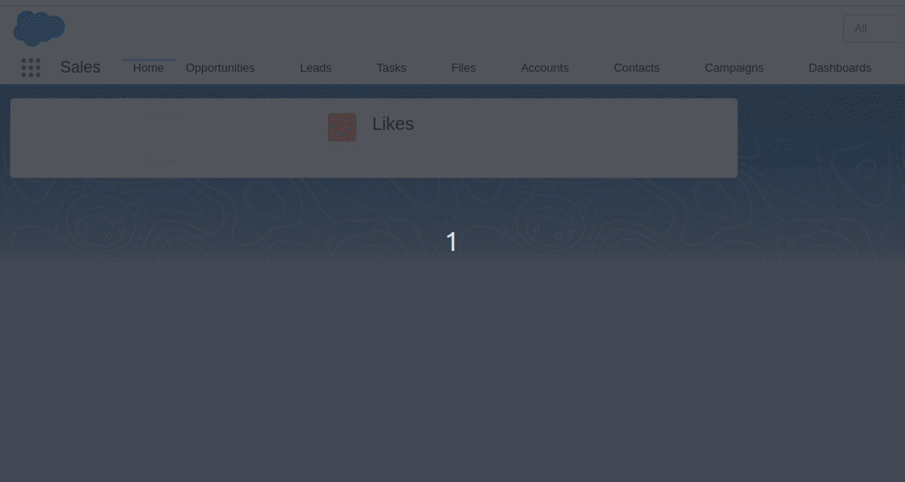

# Unsplash in LWC

This repo is a example demonstrating the use of LWC and third-party API integrations. Third-party in this case is the [Unsplash API](https://unsplash.com/developers)

You can add this LWC on you homepage and refresh the page to get a random image.

For the Unsplash API, you can create get you access_key as shown in the Getting Started documentation of the Unsplash API.
You can store the access_key in a custom setting.

## Demo:
